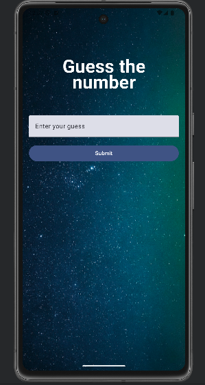

# GuessNumber
GuessNumber is a simple Android app developed using Jetpack Compose. It allows users to input guesses and determine a randomly generated number between 1 and 100. The app provides instant feedback on whether the guess is too high, too low, or correct.

## Features
### Input Field: 
Users can enter their guesses into a text field.
### Feedback: 
Immediate feedback on whether the guess is too high, too low, or correct.
### Random Number Generation: 
Generates a new random number for each game session.
### User Interaction: 
Users can submit their guess and receive feedback instantly.

## Technologies Used
### Jetpack Compose: 
Modern UI toolkit for building native Android apps.
### Kotlin: 
Programming language used for app logic.
### Random Number Generation: 
Kotlin's Random class for generating random numbers.
### Android Studio: 
IDE used for development and testing.

## Usage
To run the app, clone the repository and open it in Android Studio. Ensure you have the necessary Android SDK and Emulator set up with API level 21 (Lollipop) or higher. Run the app on an emulator or physical device to play the game.
